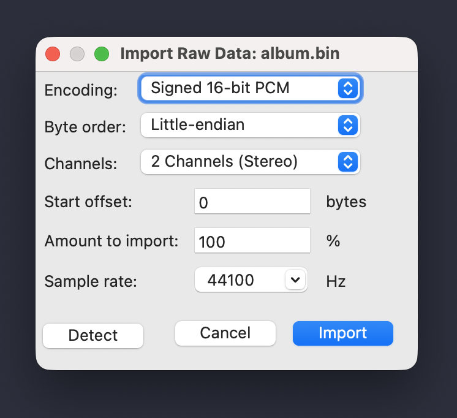

CD Authoring
============

As of version 0.9, Bandcrash supports authoring audio CDs for use with full-disc CD imaging tools. This is primarily for simplifying on-demand manufacturing with e.g. `Kunaki <https://kunaki.com>`_, but it's also useful for simplifying DIY CD replication.

When generating CDDA output, Bandcrash will generate the following files in the ``cdda`` directory:

* ``album.bin``: The raw audio track (16-bit 44100 stereo little-endian)
* ``album.cue``: a `CUE file <https://wiki.hydrogenaudio.org/index.php?title=Cue_sheet>`_ for use with standard disc-at-once burning software (e.g. `cdrdao <https://cdrdao.sourceforge.net/>`_, `ImgBurn <https://www.imgburn.com/>`__, and many others)
* ``kunaki.cue``: a CUE file in Kunaki's proprietary(?) format
* ``tracklist.tsv``: a tabbed-separated value file with useful information for importing into other places (such as creating album art)

Here are some things to keep in mind when using these authoring files.

Verifying playback
------------------

The ``ffplay`` tool from `FFmpeg <https://ffmpeg.org>`_ can be used to ensure that the audio is correct. You can play the album audio with the following command::

    ffplay --format pcm_s16le -ar 44100 -ch_layout stereo album.bin

Alternately, you can load it into something like `Audacity <https://audacityteam.org/>`_ by importing it as raw data set to 16-bit, 44100Hz, little-endian stereo:

Kunaki uploads
--------------

When uploading to Kunaki, use the "ISO and CUE file" option. Kunaki is being imprecise here, as an ``.iso`` is a particular kind of a ``.bin`` but not all ``.bin``\ s are ``.iso``\ s. Further, Kunaki has what appears to be their own proprietary and undocumented ``.cue`` format, rather than using the standard cue sheet format.

In any case, when uploading, use ``album.bin`` for the ISO and ``kunaki.cue`` for the CUE.

cdrdao
------

While the CDDA standard and most tools expect little-endian (also called LSB) audio, cdrdao expects everything to be big-endian (aka MSB, sometimes called "Motorola"). Thus, when you burn a disc, you'll need to specify the ``--swap`` option, for example::

    cdrdao writecd --device /dev/sr0 --swap album.cue

While the ``.cue`` format explicitly specifies the endianness of the file (using ``BINARY`` and ``MOTOROLA`` for little and big endian, respectively), cdrdao's parser ignores this.

ImgBurn
-------

The ``.bin`` and ``.cue`` file work without any extra effort. Point it to the ``.cue``.