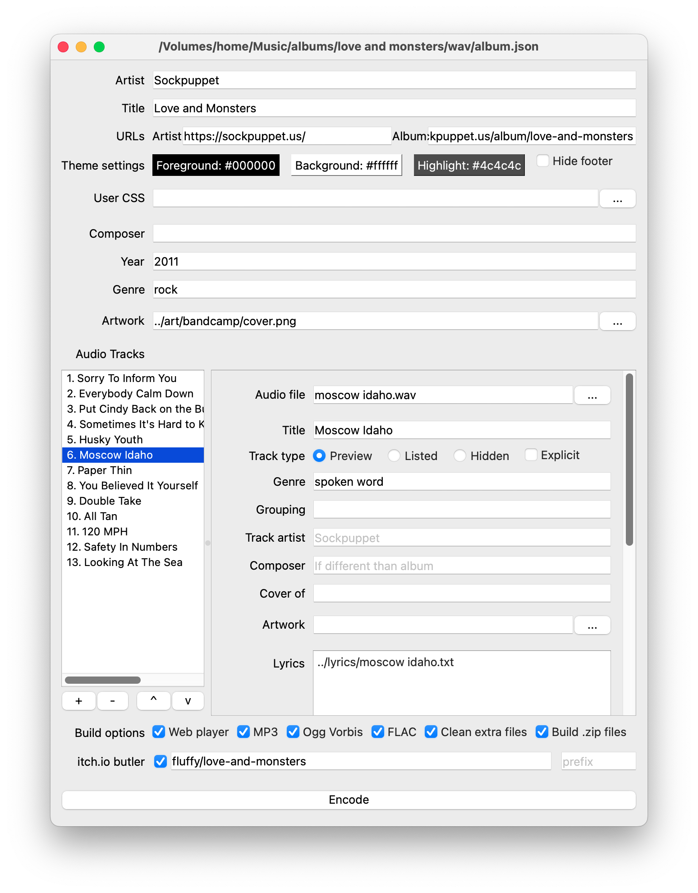

Using the GUI
=============

Installation
------------

The recommended installation source is `the official builds on itch.io <https://fluffy.itch.io/bandcrash>`_, ideally via `the itch.io app <https://itch.io/app/>`_. However, some platforms have some extra notes:

Linux/UNIX/FreeBSD/etc.
^^^^^^^^^^^^^^^^^^^^^^^

If the itch.io build doesn't work, your best option is to install it using `pipx <https://pipx.pypa.io/>`_::

  pipx install 'bandcrash[gui]'

and then launch it with ``bandcrash-gui``.

This method will also install the CLI.

macOS
^^^^^

If you are running on an Intel-based Mac, you will probably need to `build from source <https://github.com/fluffy-critter/bandcrash/?tab=readme-ov-file#installation>`_.

Launching
---------

If you launch the application without a file, it will default to trying to open an existing file. Press "Cancel" (:kbd:`Esc`) to create a new album from scratch.

It is recommended that you associate ``.bcalbum`` files with the Bandcrash GUI so that you can open them directly from your file browser. Alternately, you can drag a ``.json`` or ``.bcalbum`` file onto the application icon to open it that way.

Album Editor
------------

The various input fields should be self-explanatory. Some things probably could use a better explanation, though.

Track listing
^^^^^^^^^^^^^

You can add individual files by clicking :guilabel:`+` and selecting audio files from the file browser, or you can drag files directly into the track listing from your operating system. Either way, it will attempt to guess the title of the track (and probably get it wrong).

The :guilabel:`-` button will delete the currently-selected track.

You can rearrange tracks by dragging them within the track listing, or you can use the up and down arrow buttons to rearrange them.

Track editor
^^^^^^^^^^^^

Some of the fields may not be quite obvious.

* **Player options**: These control whether the song will be audible from the preview player, or whether they'll be hidden from view entirely (bonus tracks)
* **Track artist**: Set this to override the artist on the single track, for example if this is a compilation album or a guest artist
* **Cover of**: If this is a cover song, this should refer to the original performing artist
* **Artwork**: You can override the artwork on a per-track basis.
* **Lyrics**: You can copy-paste or otherwise enter your song's lyrics here. Alternately, you can give it the path to a plain-text file that contains the lyrics.
* **Grouping**: If you have multiple tracks that are movements of a single greater work, set the work's title here and only set the movement's title in the "Title" field.

Build options
^^^^^^^^^^^^^

This is where you set up which versions of the album to generate, and a couple of options for them.

* **Web preview**: This builds an :doc:`HTML-based player <player>` that can be uploaded to a website.
* **MP3**: This builds an album in MP3 format, which is what most people are going to download.
* **Ogg Vorbis**: Certain free-software people prefer this format, although now that MP3's patents are expired it's less desirable. It's still nice to provide it though.
* **FLAC**: This is a lossless (i.e. CD-quality) format. Most people can't tell the difference between MP3 and FLAC, but again, it's nice to provide this version.
* **CD**: This builds ``.bin`` and ``.cue`` files for mass-replication in so-called "Compact Disc" format, a physical medium that some people still use, primarily as a collector's item.
* **Build .zip files**: If this is selected, then Bandcrash will automatically produce .zip files which are easier to upload to your web host or digital downloads store.
* **Clean extra files**: This will remove any files that have found their way into the output directory. Check this if you're going to tweak the track ordering or titles or the like; uncheck it if you've put extra bonus files into the output directory (although it's usually better to provide extra files as a separate download).

itch.io options
^^^^^^^^^^^^^^^

The checkbox controls whether Bandcrash will attempt to upload your builds to itch.io. The two options are the itch target (see the :doc:`itch.io setup documentation <itch>` for more information on that) and the channel prefix, which is prepended to the name of the download channel (i.e. ``mp3``, ``preview``, etc.).

If you want to provide different versions of the album, use channel prefixes to keep them separate; for example, if you set the prefix to ``explicit-`` then that version will be built as ``explicit-mp3``, ``explicit-ogg``, and so on. An example of this in operation is with `Novembeat 2022: Original Soundtrack <https://fluffy.itch.io/novembeat-2022>`_, where the album is uploaded as "OST" and "BGM" versions for different use cases.

Encode button
^^^^^^^^^^^^^

Press this, and Bandcrash will ask you where to save the output files and do its magic. After it finishes, click "Open" to have it automatically open your output directory so that you can access the .zip files or open the web preview or the like.

Preferences
-----------

There are also a number of preferences you can set (``Bandcrash > Preferences`` on macOS, ``Edit > Preferences`` everywhere else):

* Number of threads: This is the maximum number of processes to run in parallel while encoding an album. You should generally set this to the number of cores on your CPU.
* Encoder options: These are the options used by the built-in FFMPEG encoder for each encode type:
    * Preview and MP3 use `libmp3lame <https://www.ffmpeg.org/ffmpeg-codecs.html#libmp3lame-1>`_
    * Ogg Vorbis uses `libvorbis <https://www.ffmpeg.org/ffmpeg-codecs.html#libvorbis>`_
    * FLAC uses `flac <https://www.ffmpeg.org/ffmpeg-codecs.html#flac-2>`_
* Butler binary: Where to find butler, the tool used to automatically upload files to itch.io.

Uploading to itch
-----------------

If you plan on uploading your albums to `itch.io <https://itch.io>`_, it is highly recommended that you install `butler <https://itch.io/docs/butler/>`_ (ideally from `the itch app <https://itch.io/app>`_). After doing this, open the preferences and then point the "Butler binary" selection to the downloaded Butler executable.

.. TIP::
   If you're using the Itch app, you can find the binary by going to Butler in your library, clicking the gear icon, then selecting "Manage" and looking at the ``Show in Finder/Explorer`` button.

   .. image:: wheres-butler.png
      :alt: Where to see the Butler binary path

After that, click the "Connect" button on the Bandcrash preferences dialog to log in to itch via Butler (or run ``butler login`` from the command line), and you should be all set.
