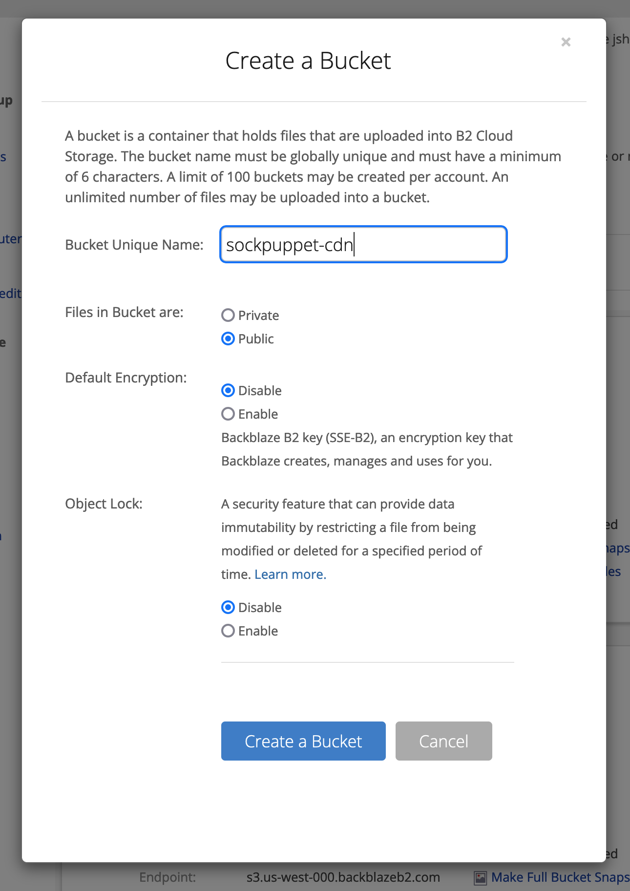
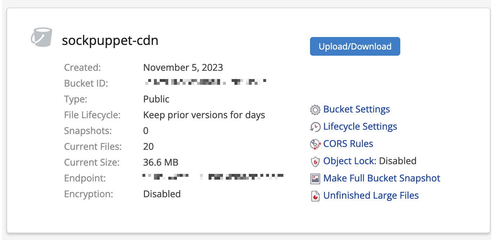
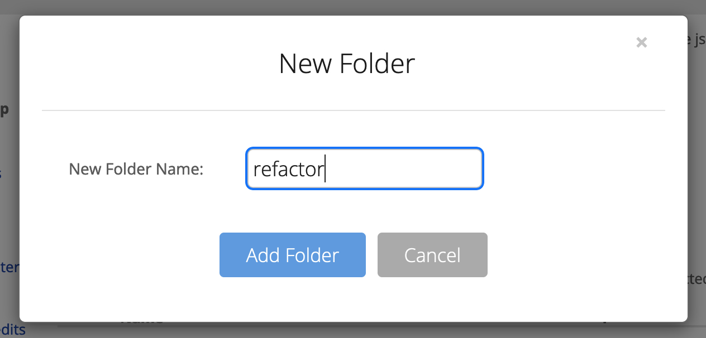
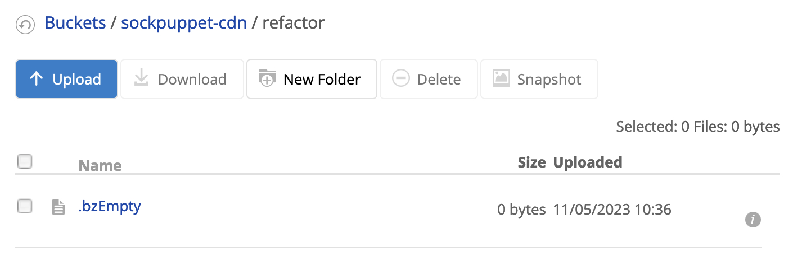
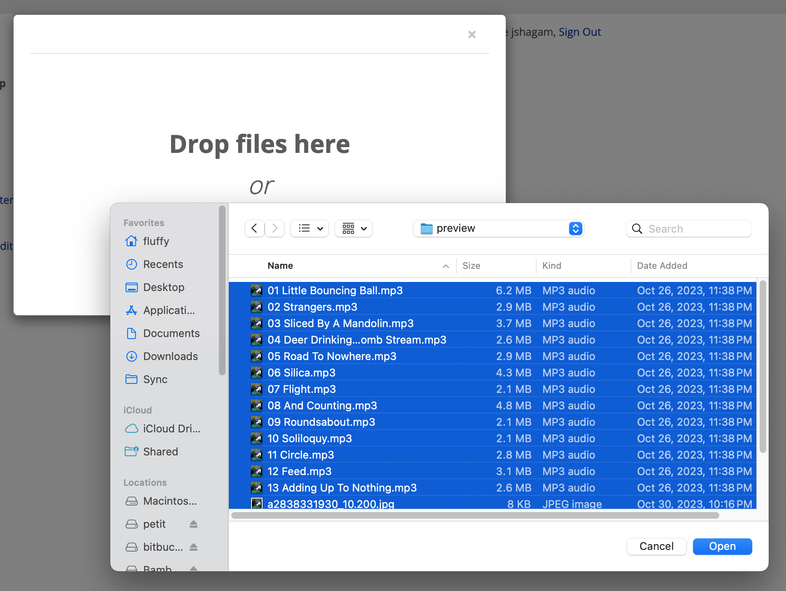
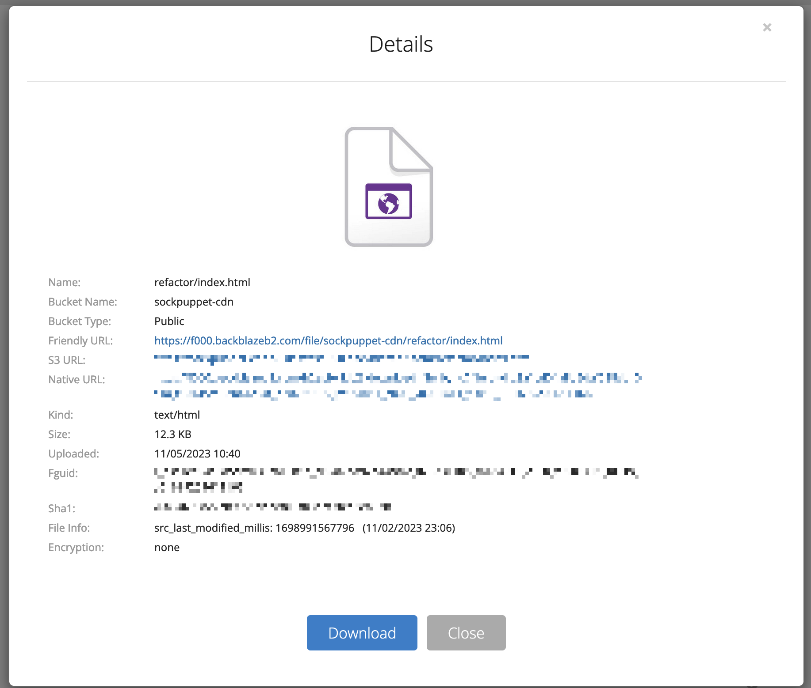

Using the Web Player
====================

The web player is provided as a folder (and possibly zip file) which contains the preview-quality audio tracks and an HTML interface. You can upload the ``preview/`` directory somewhere and then point an ``<iframe>`` at it. This way you can share your album preview on a website that you manage with whatever tools you prefer.

Embedding the player
--------------------

If your website operator allows you to write arbitrary HTML, then all you have to do to embed the player is to insert an ``<iframe>`` tag as raw HTML, with the ``src`` attribute pointing to the player; the specific details will depend on which hosting option you go with.

However, this isn't totally obvious on every website platform! So here's some quick tips for various popular platforms.

* Squarespace: `Embed blocks <https://support.squarespace.com/hc/en-us/articles/206543617-Embed-Blocks>`_
* Wix.com: `Embedding a site or a widget <https://support.wix.com/en/article/wix-editor-embedding-a-site-or-a-widget>`_
* Wordpress.com: If you have a `plugin-enabled site <https://wordpress.com/support/wordpress-editor/blocks/custom-html-block/#supported-html-tags>`_ you can type ``/html`` to get a raw HTML block

If you know of others, please `let me know about them <https://github.com/fluffy-critter/bandcrash/issues/new>`_ so that I can share it here!

Hosting options
---------------

itch.io
^^^^^^^

If you're using the :doc:`itch.io uploader <itch>`, they provide a `player embed <https://itch.io/updates/introducing-game-embeds>`_. For example, this code:

.. code-block:: html

    <iframe frameborder="0" src="https://itch.io/embed-upload/8976401?color=333333" allowfullscreen="" width="100%" height="620"><a href="https://fluffy.itch.io/novembeat-2017">Play Novembeat 2017 on itch.io</a></iframe>

renders as:

.. raw:: html

    <iframe frameborder="0" src="https://itch.io/embed-upload/8976401?color=333333" allowfullscreen="" width="100%" height="620"><a href="https://fluffy.itch.io/novembeat-2017">Play Novembeat 2017 on itch.io</a></iframe>

Due to Bandcrash's existing integration with the itch.io uploader (as well as itch.io's pre-existing payments platform), this is likely the easiest approach for most users.

Backblaze B2
^^^^^^^^^^^^

`Backblaze <https://backblaze.com>`_ is a well-known provider of mass file storage. They started out as an offsite backup system but eventually productized their storage fabric, called `B2 <https://www.backblaze.com/cloud-storage>`_. This approach is incredibly affordable; at the time of writing, it costs only $0.006/GB/month for storage and (effectively) $0.007/GB/month for outgoing transfer, and there's an incredibly generous free cap of 10GB of storage and 30GB/month of transfer. So, for most musicians, it will be *effectively* free (at least, as of November 2023).

Hosting your Bandcrash player on B2 is also fairly straightforward. After signing up for B2, go to the `B2 dashboard <https://secure.backblaze.com/b2_buckets.htm>`_ and create a new bucket for your file hosting, set to public and no encryption:

When you want to upload an album, select "Upload/Download" and then "New Folder," and give the folder a meaningful name:

Click on the folder and you'll have an empty folder with an enticing "Upload" button.

Click "Upload," and then drag the contents of your album's "preview" folder onto the upload widget (or, alternately, click the "click to select a file" link and select your preview folder's contents).

Finally, after the upload finishes you'll have a directory full of files. Scroll down to the ``index.html`` file, click the little "i" button to the right of it, and copy the "Friendly URL" link:

This is the embeddable URL for the album. On your website, point an ``<iframe>`` to this URL; for example, the raw HTML:

.. code-block:: html

  <iframe frameborder="0" src="https://f000.backblazeb2.com/file/sockpuppet-cdn/refactor/index.html"
    width="100%" height="480">
    <a href="https://f000.backblazeb2.com/file/sockpuppet-cdn/refactor/index.html">Refactor by Sockpuppet</a>
  </iframe>

will embed as:

.. raw:: html

  <iframe frameborder="0" src="https://f000.backblazeb2.com/file/sockpuppet-cdn/refactor/index.html"
    width="100%" height="480">
    <a href="https://f000.backblazeb2.com/file/sockpuppet-cdn/refactor/index.html">Refactor by Sockpuppet</a>
  </iframe>

Backblaze would prefer that you use a fronting CDN to serve up these files. This adds extra expense and setup complexity, but they've provided some guides for some common CDNs; the two most worth considering are:

* `Bunny <https://www.backblaze.com/docs/cloud-storage-integrate-bunnynet-with-backblaze-b2>`_ (starts at $1/month, and is well-regarded)
* `Cloudflare <https://www.backblaze.com/docs/cloud-storage-deliver-private-backblaze-b2-content-through-cloudflare-cdn>`_ (essentially free for this use case, but there are political reasons to avoid them)

This list is non-exhaustive, and there are other CDNs out there with a different mix of performance, expense, and features.

Advanced users will also probably want to use the `B2 command-line tools <https://www.backblaze.com/docs/cloud-storage-command-line-tools>`_ to manage their uploads, which can be a little easier to deal with especially if you have a tendency to fiddle a lot.

Static file hosting
^^^^^^^^^^^^^^^^^^^

If you already have your own website on a host that lets you upload and serve up raw files (such as `Dreamhost <https://dreamhost.com/>`_ or `Nearly Free Speech <https://nearlyfreespeech.net>`_ or the like), you can upload the player directly to your website and then point the ``<iframe>`` to it. For example, if you upload your preview directory to ``https://example.com/my-album/``, then you can embed it as:

.. code-block:: html

   <iframe src="https://example.com/my-album/" width=640 height=480 seamless>
   <a href="https://example.com/my-album/">Listen to my album</a>
   </iframe>

For example:

.. code-block:: html

   <iframe frameborder="0" src="https://cdn.sockpuppet.us/novembeat-2021/" width="100%" height="480" seamless>
   <a href="https://cdn.sockpuppet.us/novembeat-2021/">Lo-Fi Beats to Grind Coffee To</a>
   </iframe>

will look like:

.. raw:: html

   <iframe frameborder="0" src="https://cdn.sockpuppet.us/novembeat-2021/" width="100%" height="480" seamless>
   <a href="https://cdn.sockpuppet.us/novembeat-2021/">Lo-Fi Beats to Grind Coffee To</a>
   </iframe>

All things considered, this is probably your best and cheapest option, if you already have compatible web hosting.
